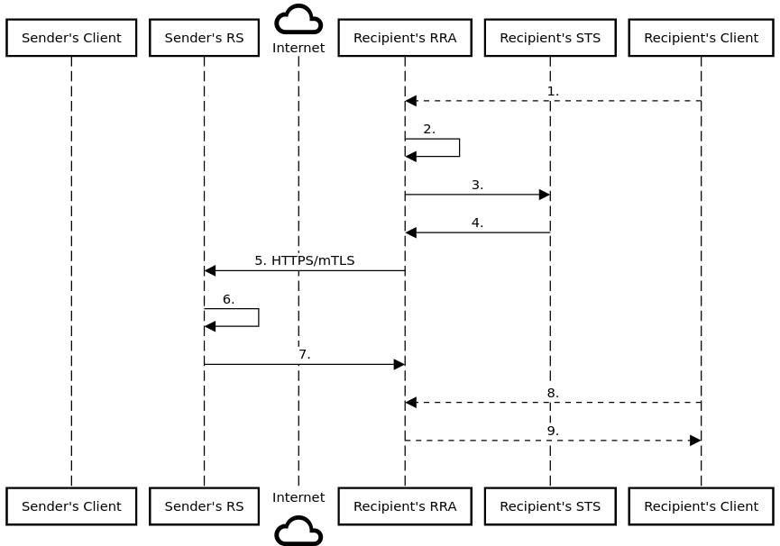

# GRIP Resource Retrieval System

## Abstract

An pull-based Resource Retrieval System (RRS) implements the [Global Reference Identity Protocol (GRIP)](https://github.com/cargomail-org/grip) to overcome an SMTP MTA deficiency.

## Description

The RRS transfers data between untrusted hosts across the internet using the HTTPS/mTLS protocol. Given that, the RRS uses an OAuth2 delegation mechanism — mTLS certificate-bound access tokens issued by the Security Token Service (STS) — to convey the user's security context alongside arbitrary data between computers. This concept is generally applicable not only to store-and-forward (push), but also to store-and-retrieve (pull) systems.

## Internet Mail 2000 Legacy

This effort enhances the [Internet Mail 2000](https://en.wikipedia.org/wiki/Internet_Mail_2000) concept proposed by Daniel J. Bernstein by using a specific [OAuth 2.0-based mechanism](https://github.com/cargomail-org/grip) designed on the principle that the final storage of linked binary data (blobs) referenced in the message should be the responsibility of the recipient and not of the sender as it is with the SMTP-based mail architecture.

## Model

## Advantages Compared to SMTP MTA

#### Enhanced Email Experience

RRS ensures the automatic transfer of linked files from sender to recipient. Consequently, users don't struggle with expired links to shared documents and media files. This feature, coupled with the mitigation of OAuth 2.0 consent phishing attack, improves the user's experience.

## Sequence Diagram

#### An RRA-to-RS flow

Pull mode using the [2-legged Identity Propagation](https://github.com/cargomail-org/grip#2-legged-oauth-20-identity-propagation) flow. The RRA transfers data between untrusted hosts via the HTTPS/mTLS connection.

<b>1.</b> A recipient uses the client to retrieve a message resource via the recipient's RRA using its bearer access token (obtained from previous successful local OIDC flow). 
<b>2.</b> The recipient's RRA impersonates the recipient (typically using the recipient identifier from the access token) and generates an impersonated, signed certificate-bound assertion in JWT format. 
<b>3.</b>, <b>4.</b> The recipient's RRA exchanges the impersonated assertion at the STS for a delegated, signed certificate-bound assertion in JWT format via the mTLS connection. 
<b>5.</b> With the delegated certificate-bound assertion, the recipient's RRA tries to access the sender's RS to fetch the message resource via the mTLS connection. 
<b>6.</b> The sender's RS validates proof of possession—verifies the mTLS certificate and the delegated certificate-bound assertion. In our example, it's good, and the sender's RS accepts the incoming fetch request. 
<b>7.</b> The sender's RS returns the message resource. 
<b>8.</b>, <b>9.</b> The recipient's client can access the fetched message resource using its bearer access token (obtained from previous successful local OIDC flow).

The sender's client is not involved in the pull flow.

## Implementation

[Cargomail](https://github.com/cargomail-org/cargomail), an OAuth 2.0-based email system, is a prototype implementation of RRA-to-RS communication.

